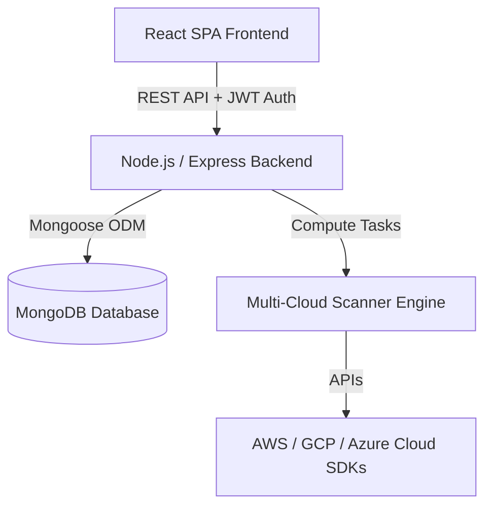

# Security Audit Accelerator: Comprehensive System Documentation

> [!NOTE]
> This document provides the complete structural, technical, and operational specifications for the **Security Audit Accelerator** application. It details the design logic, multi-cloud scanning mechanics, historical trend logic, and core UI design tokens.

---

## 1. Project Overview

The **Security Audit Accelerator** is a high-performance, enterprise-grade cloud governance and compliance monitoring platform. It is engineered to give security operations (SecOps) teams, cloud architects, and system administrators a consolidated, real-time posture assessment of their multi-cloud environments (AWS, GCP, Azure).

### Core Philosophy
* **Zero-Friction Visibility**: Eliminate the need to parse raw JSON logs from separate cloud providers.
* **Unified Metrics**: Standardize compliance scores across different service structures.
* **Proactive Security**: Track vulnerability progression day-over-day to prevent drift in cloud configurations.

---

## 2. Technical Stack Architecture

The application is structured as a decoupled, full-stack web application designed for high scalability and responsiveness:



### Frontend Architecture
* **Core Framework**: React (Single Page Application).
* **Styling**: Vanilla CSS utilizing a customized, premium CSS custom property (variables) design system with glassmorphic elements, smooth gradients, and support for high-contrast dark modes.
* **Visualization**: Recharts (for lightweight, responsive SVG charts: Bar Chart for score tracking, Line Chart for vulnerability progress).
* **State Management**: React state hooks coupled with highly responsive, decoupled sessionStorage strategies for persistent historical log views.

### Backend Architecture
* **Application Framework**: Node.js with Express.js.
* **Authentication**: JSON Web Token (JWT) stateless authorization mechanism.
* **Database Layer**: MongoDB utilizing Mongoose ORM for project metadata and raw scan records.
* **PDF Exporter Engine**: Node.js backend rendering high-fidelity reports directly from dynamically compiled server-side HTML/CSS engines.

---

## 3. Key Core Features & System Operations

### A. 77-Checkpoint Automated Multi-Cloud Scanner
The scanning engine automates deep security assessments against the **77-Checkpoint Compliance Standard** representing critical Center for Internet Security (CIS) Benchmarks:
* **Identity & Access Management (IAM)**: Audits multi-factor authentication (MFA), access keys age, policy over-provisioning, and inactive credentials.
* **Network Security**: Port-level analysis (checks for open port 22/3389, public accessibility of databases, security group misconfigurations).
* **Data Protection**: Encryption status of object storage (S3/GCS buckets), relational databases, and block store volumes.
* **Logging & Monitoring**: Checks configuration status of CloudTrail/Cloud Logging, bucket logging, and audit logs.

### B. Dynamic Security Scoring Mechanism
The compliance rating of a project is calculated using a strict, binary safety scoring system:

$$\text{Security Score} = \left( \frac{\text{Healthy Resources}}{\text{Total Scanned Resources}} \right) \times 100$$

> [!IMPORTANT]
> **Strict Safety Standard**: A resource is classified as **Healthy** if and only if it has *zero* vulnerability findings. Even a single vulnerability (Low, Medium, High, or Critical) marks the resource as Vulnerable, excluding it from the healthy score pool.

### C. "Healthy Resources" & Vulnerability Management
* **Secured to Healthy Renaming**: Realigned UI semantics from "Secured Resources" to **"Healthy Resources"** to reflect industry-standard IT health-check compliance models.
* **Granular Breakdown**:
  * **Vulnerable View**: Filters and lists only resources with open alerts.
  * **Healthy View**: Displays resources with a clean security report.
  * **Safe-Logged Resources**: Distinguishes between explicitly logged safe resources and non-violating quiet assets.

### D. Audit Coverage & Skipped Checks Audit Log
To guarantee audit transparency, the dashboard features **Audit Coverage** metrics detailing the execution depth of the active scan.
* If a cloud service is disabled or api limits are hit, the scanner flags those specific checks as "Skipped" instead of "Failed."
* **Skipped Checks Drawer**: Provides a clean breakdown of exactly which check was skipped, the affected service, and the technical reason (e.g., *API permission denied*, *Service disabled in region*).

---

## 4. Trend Intelligence & Chart Logics

To handle high-frequency scanning without compromising clarity, the dashboard splits analytical intelligence into two distinct charts:

### Chart 1: Security Score Trend (Bar Chart)
Designed for high-frequency scan audits within a single day.
* **Visualization**: Grouped Bar Chart.
* **Behavior**: If a user runs multiple scans in a single day (e.g. 10 scans on Day 1), the bar chart renders **all scan scores side-by-side** for that day.
* **Color Coding**: Dynamic bar colors corresponding to score levels:
  * Green (`#10b981`) for scores > 80% (Healthy)
  * Yellow (`#f59e0b`) for scores 50% - 80% (Warning)
  * Red (`#ef4444`) for scores < 50% (High Risk)

### Chart 2: Vulnerability Trend (Line Chart)
Designed for long-term executive progress tracking.
* **Visualization**: Single premium glowing Line Chart.
* **Problem Solved**: Prevents chart crowding and chaotic overlapping lines.
* **Intelligent Day Selection**:
  * If a user runs **10 scans in a single day**, the line chart automatically filters out the first 9, plotting a single point representing **only the 10th (absolute last) scan** of that day.
  * If the next day has **5 scans**, it plots the **5th (absolute last) scan**.
* **Metrics Tracked**: Plots **Total Active Issues** (Sum of Critical + High + Medium vulnerability counts).
* **Enhanced Tooltip**: Features a premium hover state detailing the total active vulnerability count along with the exact time of that final scan (e.g., `Total Issues: 145 (at 06:14 PM)`).

---

## 5. UI Design Token System (CSS Spec)

The interface follows a curated design system styled exclusively using vanilla CSS custom properties:

| CSS Custom Token | Value / Purpose |
| :--- | :--- |
| `--color-primary` | `#6366f1` (Indigo - Premium Brand Identity) |
| `--color-success` | `#22c55e` (Emerald Green - Healthy Status) |
| `--color-warning` | `#eab308` (Yellow - Non-critical Alerts) |
| `--color-danger` | `#ef4444` (Vivid Red - Critical Security Risks) |
| `--color-bg-secondary`| Glassmorphic card backgrounds with `backdrop-filter: blur(12px)` |
| `--shadow-md` | Soft elevation shadows using dynamic rgba configurations |
| `--radius-lg` | Standardized `16px` border-radius for smooth, modern cards |

---

## 6. Database Models (Mongoose Schemas)

### Scan Record Schema
```javascript
const ScanSchema = new mongoose.Schema({
  project: { type: mongoose.Schema.Types.ObjectId, ref: 'Project' },
  score: { type: Number, required: true },
  scannedResources: { type: Number, required: true },
  criticalCount: { type: Number, default: 0 },
  highCount: { type: Number, default: 0 },
  mediumCount: { type: Number, default: 0 },
  totalChecks: { type: Number, default: 77 },
  skippedChecks: { type: String }, // JSON string containing { service, reason }
  findings: [{
    resource: { type: String, required: true },
    service: { type: String, required: true },
    severity: { type: String, enum: ['Critical', 'High', 'Medium', 'Low'], required: true },
    title: { type: String, required: true },
    description: { type: String }
  }],
  createdAt: { type: Date, default: Date.now }
});
```

---

> [!TIP]
> This specification matches the production implementation active on live branches. For presentation details and slide outline, refer to [Presentation Slides](file:///C:/Users/hp/.gemini/antigravity/brain/ed9f675e-b427-4a6e-9c09-802e7a10c722/security_audit_accelerator_presentation.md).
